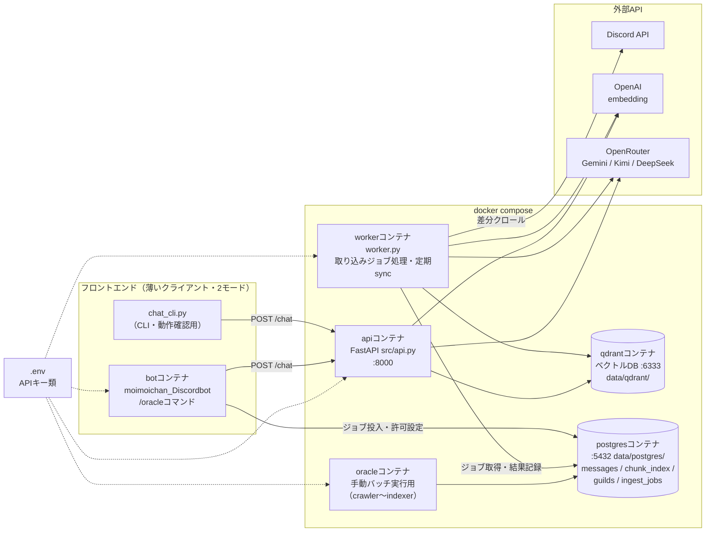
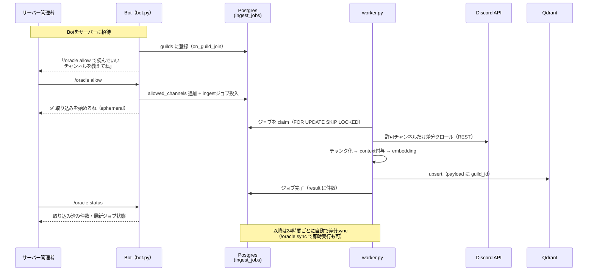
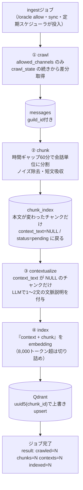
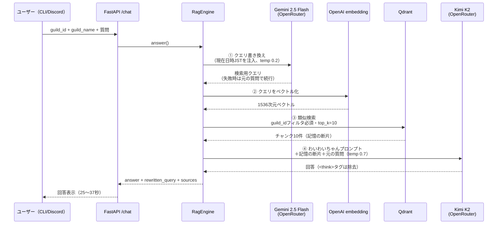

# 処理フロー・設計図（Mermaid）

現在の waiwai-oracle の全体像を4つの視点で図解する。
（2026-06-11 時点: SaaS化ステップ2「マルチテナント自動取り込み」反映後）

## ① 全体像（コンテナ構成・運用視点）

**ポイント**: Bot は「ジョブを予約する係」、worker は「実際に取り込む係」に分業。
重い処理（クロール・LLM・embedding）はすべて worker に隔離され、Bot の応答は止まらない。

## ② サーバー導入から質問できるまで（自動取り込みフロー）

**ポイント**: 招待しただけでは何も読まない（opt-in）。`/oracle deny` で許可を取り消すと
該当チャンネルのデータが Qdrant / Postgres から削除され、Bot をサーバーから外すと
サーバー全体のデータが削除される（purgeジョブ）。

## ③ 取り込みパイプライン（ワーカー内部・ジョブ1件の処理）

**ポイント**: 各段階が冪等なので、途中で失敗しても次のジョブで続きから処理される。
差分syncでは「新着分＋伸びた末尾チャンク」だけが再処理され、APIコストが最小になる。

## ④ 回答フロー（質問1回あたりの処理）

**ポイント**:

- ③の **guild_idフィルタが必須**なのがマルチテナントの肝。別サーバーのデータは構造的に見えない
- guild_name は Bot がリクエストに載せるので、どのサーバーでも「そのサーバーの名前」で答える
- ①が失敗しても止まらず元の質問で検索続行（フォールバック設計）
- 所要時間の大半は④のKimi K2の生成。高速化するならここのモデル変更が効く
