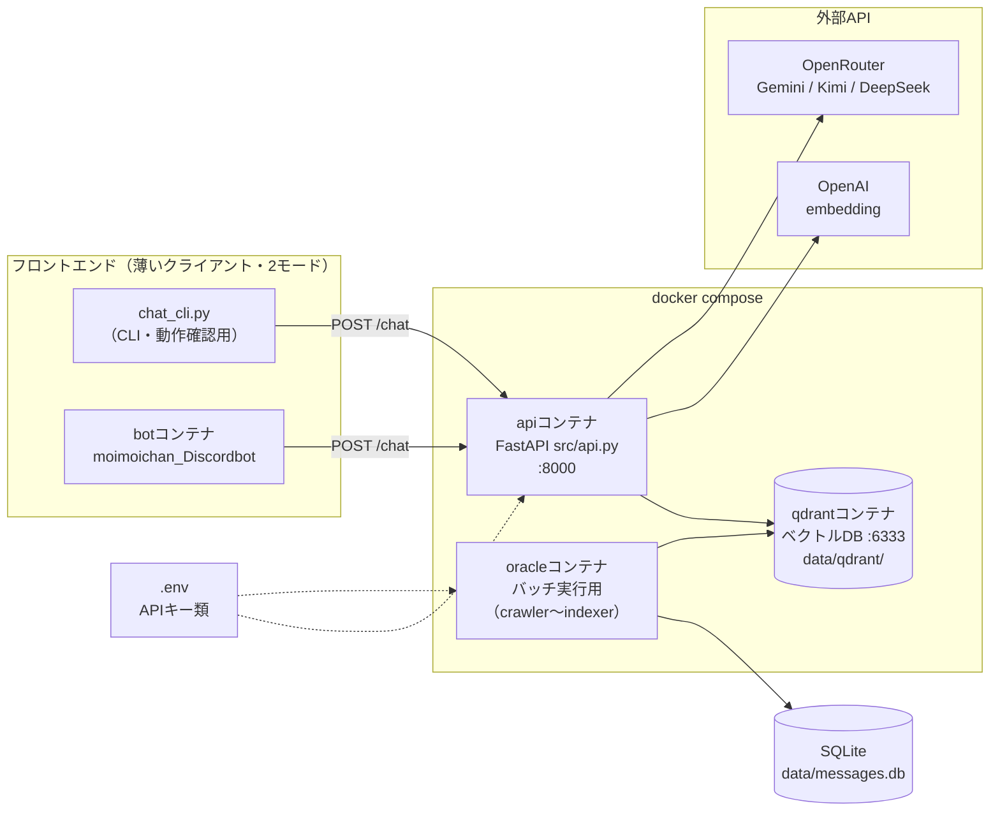
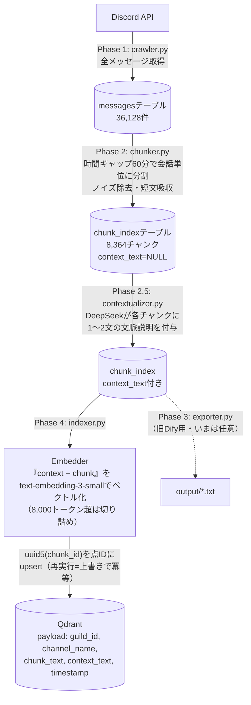
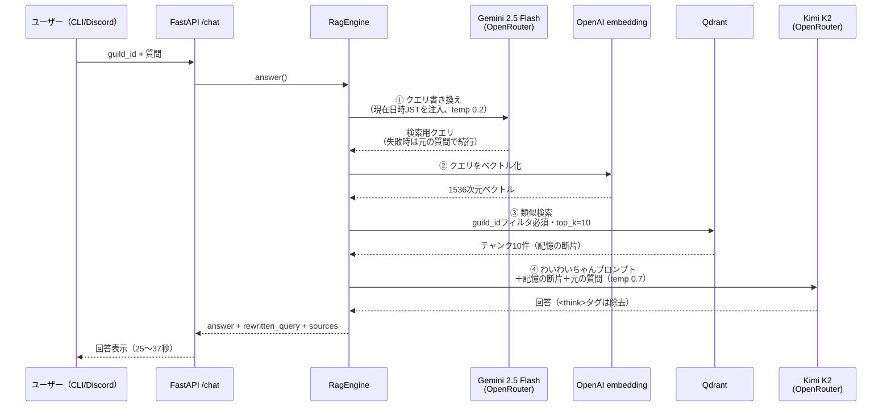

# 処理フロー・設計図（Mermaid）

現在の waiwai-oracle の全体像を3つの視点で図解する。
（2026-06-11 時点: Dify廃止・Qdrant + FastAPI 自前RAGスタック移行後）

## ① 全体像（コンテナ構成・運用視点）

**ポイント**: フロントは2つともAPIを呼ぶだけ。RAGの頭脳はすべて `api` コンテナ側に
あるので、フロントを増やしても（Web UIなど）本体は無変更でよい。

## ② 取り込みパイプライン（Phase 0〜4・バッチ）

**ポイント**: 各フェーズは独立したスクリプトで、途中失敗しても再実行すれば
続きから動く（status列で管理）。

## ③ 回答フロー（質問1回あたりの処理）

**ポイント**:

- ③の **guild_idフィルタが必須**なのがマルチテナントの肝。別サーバーのデータは構造的に見えない
- ①が失敗しても止まらず元の質問で検索続行（フォールバック設計）
- 所要時間の大半は④のKimi K2の生成。高速化するならここのモデル変更が効く
